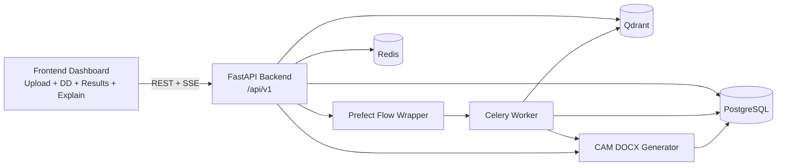
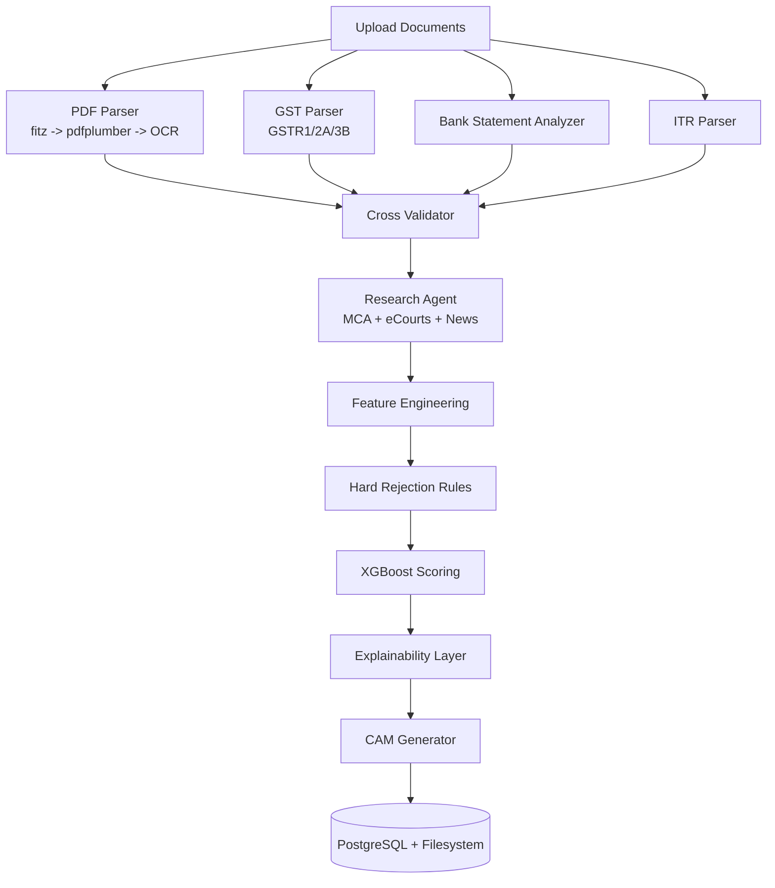

# Intelli-Credit Architecture

## High-level Diagram

## Required Architecture Alignment

This repo implements the required runtime split:

- Frontend (Next.js): Upload -> Live Logs (SSE) -> Charts/Explainability -> CAM Download/Chat
- Backend (FastAPI): Routers -> Pipeline orchestration -> ML scoring -> CAM generation
- Storage: PostgreSQL (records) + Qdrant (vector memory) + Delta Lake (Databricks/local Spark)
- External APIs: Firecrawl (web research), Hugging Face (Qwen OCR + free LLM), Gemini (CAM chat/narrative)

## Required Pillar Flow

1. Multi-Source Data Input
2. Document Processing Layer (OCR + LLM parsing)
3. Structured Knowledge Store (Vector DB + SQL)
4. Web Research Agent (real-time crawling)
5. Risk Scoring Engine (explainable ML)
6. CAM Generator (LLM + template)
7. Credit Officer Portal (human-in-the-loop due diligence)

## Backend Domain Flow

## API-to-Model Mapping

- `POST /api/v1/companies`
  - Writes `companies`
- `POST /api/v1/companies/{id}/documents`
  - Writes `documents`
- `POST /api/v1/companies/{id}/analyze`
  - Creates `analysis_runs` entry, launches pipeline
- `POST /api/v1/companies/{id}/dd-input`
  - Writes `due_diligence_records`
- Analysis pipeline output:
  - `risk_scores`
  - `research_finding_records`
  - `cam_outputs`
  - `analysis_runs.result_payload`

## Key Design Choices

1. Mock-first external intelligence:
   - Keeps demos deterministic without API-key dependency.
2. Response envelope standardization:
   - Every v1 endpoint includes `meta.request_id` and timing.
3. Asynchronous orchestration with safe CPU offloading:
   - I/O remains async; CPU-heavy inference/reporting is offloaded to worker threads.
4. India-context explicit modeling:
   - GST ITC fraud thresholds, sector multipliers, regulatory terminology.
5. Explainability-first output:
   - SHAP-like factor attribution + plain-language decision narrative + audit trail.

## Performance Notes

- Current optimized defaults:
  - Reduced model warm-up overhead
  - Fast heuristic explainability in mock mode
- Verified:
  - Backend API compile + smoke test
  - Full frontend production build
  - Backend tests passing (`5 passed`)
